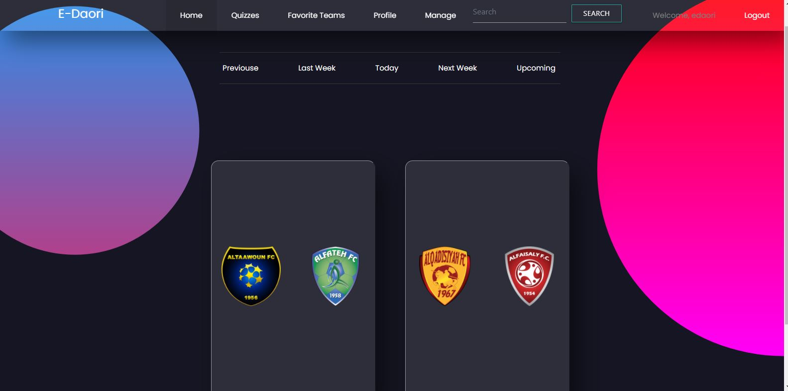
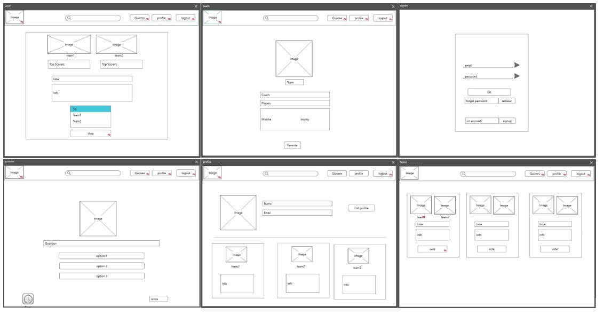

# [The E-Daori](https://edaoir.herokuapp.com/auth/signin) 

 E-Daori website is the destination for every saudi soccer fan, it provides an easy (and live) access to all of your favorite teams' scores, upcoming matches, players statistics and so much more! 

 Home page of E-Daori website 

# How to start?
1. Enter The [E-Daori](https://edaoir.herokuapp.com/auth/signin) website.
2. Naviagte the home page for: 
  

* Today's matches.

* Last and next week's matches.

* Previous and upcoming matches.

3. Sign up to vote and keep track of your favorite team and customize your profile.

# List of technologies used in this project:

* HTML
* CSS
* JavaScript
* Bootstrap
* Materialize 
* [Football API](https://www.api-football.com/)
* [Mockplus WireFrame Tool](https://www.mockplus.com)
* Node js
* MongoDB
* Heroku 

# Wireframes:

# User Stories:
<li> As a user, I want to have control over my profile, do that i can customize it.
<li> As a user, I want to store my favorite team, so that I can keep track of it.
<li> As a user, I want the my quizz score to be shown, so that I can share it.
<li> As a user, I want search teams by name, so that I can reduce the navigation time.
<li> As an user, I want to be able to deactivate my account, so that it will no longer be on the web. 

# Main Features:
* Signup/Signin
* Edit profile
* Search a team
* View ordered matches based on the current date
* View team statistics
* View player statistics
* Add favorite teams
* Vote for Match

# Future Work For The Maze
<li> News section</li>
<li> Email notification</li>
<li> Forget password</li>
<li> Top Scores</li>